# 设计模式

## 设计原则

|开闭原则	|对扩展开放，对修改关闭|	降低维护带来的新风险
|依赖倒置原则	|高层不应该依赖低层，要面向接口编程	|更利于代码结构的升级扩展
单一职责原则	|一个类只干一件事，实现类要单一|	便于理解，提高代码的可读性
接口隔离原则|	一个接口只干一件事，接口要精简单一|	功能解耦，高聚合、低耦合
迪米特法则	|不该知道的不要知道，一个类应该保持对其它对象最少的了解，降低耦合度	|只和朋友交流，不和陌生人说话，减少代码臃肿
里氏替换原则	|不要破坏继承体系，子类重写方法功能发生改变，不应该影响父类方法的含义|	防止继承泛滥
合成复用原则	|尽量使用组合或者聚合关系实现代码复用，少使用继承|	降低代码耦合

[toc]

## 创建型模式分为以下几种。

单例（Singleton）模式：某个类只能生成一个实例，该类提供了一个全局访问点供外部获取该实例，其拓展是有限多例模式。
原型（Prototype）模式：将一个对象作为原型，通过对其进行复制而克隆出多个和原型类似的新实例。
工厂方法（FactoryMethod）模式：定义一个用于创建产品的接口，由子类决定生产什么产品。
抽象工厂（AbstractFactory）模式：提供一个创建产品族的接口，其每个子类可以生产一系列相关的产品。
建造者（Builder）模式：将一个复杂对象分解成多个相对简单的部分，然后根据不同需要分别创建它们，最后构建成该复杂对象。

### 单例设计模式

单例（Singleton）模式的定义：指一个类只有一个实例，且该类能自行创建这个实例的一种模式。例如，Windows 中只能打开一个任务管理器，这样可以避免因打开多个任务管理器窗口而造成内存资源的浪费，或出现各个窗口显示内容的不一致等错误。

在计算机系统中，还有 Windows 的回收站、操作系统中的文件系统、多线程中的线程池、显卡的驱动程序对象、打印机的后台处理服务、应用程序的日志对象、数据库的连接池、网站的计数器、Web 应用的配置对象、应用程序中的对话框、系统中的缓存等常常被设计成单例。

单例模式在现实生活中的应用也非常广泛，例如公司 CEO、部门经理等都属于单例模型。J2EE 标准中的 [Servlet](http://c.biancheng.net/servlet/)Context 和 ServletContextConfig、[Spring](http://c.biancheng.net/spring/) 框架应用中的 ApplicationContext、数据库中的连接池等也都是单例模式。

单例模式有 3 个特点：

1. 单例类只有一个实例对象；
2. 该单例对象必须由单例类自行创建；
3. 单例类对外提供一个访问该单例的全局访问点。


```java
public class Singeton{
    private static volatile Singleton singleton=null;
    
    private Singleton (){
        
    }
    public static synchronized Singleton getInstance(){
        if(singleton==null){
            return new Singleton();
        }
        return singleton;
    }
    
}

public class Singleton {
 private final static singlon=new Singlon();
 private Singlon(){
 }
 public static Singlon getSinglon(){
   return singlon;
 }
   public static void main(String arg){
      LocalDate localDate=LocalDate.now();
      System.out.println(localDate);
   }
}

public class singleton {
    private static class singletonClass{
        private static Singleton sinleton= new Singleton();
        
    }
    public static Singleton getIntance(){
        return SingletonClass.sinleton;
    }
}

public enum Singleton {
    INTANCE;
    
    public static Singleton getInstance(){
        return INTANCE;
    }
    public void method(){
        
    }
}
```


### 原型模式

原型（Prototype）模式的定义如下：用一个已经创建的实例作为原型，通过复制该原型对象来创建一个和原型相同或相似的新对象。在这里，原型实例指定了要创建的对象的种类。用这种方式创建对象非常高效，根本无须知道对象创建的细节。例如，Windows 操作系统的安装通常较耗时，如果复制就快了很多。在生活中复制的例子非常多，这里不一一列举了。


```java
public class Realizetype implements Cloneable{

  Realizetype(){
  
  }
  
  @Override
  public Relizetype clone(){
  return (Relezetype)super.clone();
  }
 
} 

```

### 简单工厂

简单工厂 ： 用来生产同一等级结构中的任意产品。（对于增加新的产品，无能为力）

工厂方法 ：用来生产同一等级结构中的固定产品。（支持增加任意产品） 

 抽象工厂 ：用来生产不同产品族的全部产品。（对于增加新的产品，无能为力；支持增加产品族）  

​       定义一个创建产品对象的工厂接口，将产品对象的实际创建工作推迟到具体子工厂类当中。这满足创建型模式中所要求的“创建与使用相分离”的特点


### 工厂方法


对简单工厂模式的进一步抽象化，其好处是可以使系统在不修改原来代码的情况下引进新的产品，即满足开闭原则


### 抽象工厂

​    [工厂方法模式]只考虑生产同等级的产品，但是在现实生活中许多工厂是综合型的工厂，能生产多等级（种类） 的产品，如农场里既养动物又种植物，电器厂既生产电视机又生产洗衣机或空调，大学既有软件专业又有生物专业等。

```mermaid
classDiagram


ProductOne <|.. ProductOneA: implements
ProductOne <|.. ProductOneB: implements

AbstractProduct <|.. AbstractProductA: implements
AbstractProduct <|.. AbstractProductB: implements

ProductTwo <|.. ProductTwoA: implements
ProductTwo <|.. ProductTwoB: implements

ProductOne <.. AbstractProduct
ProductTwo <.. AbstractProduct



AbstractProduct <.. client

ProductOne <.. client
ProductTwo <.. client

class ProductOne{
<<interface>>
+show() void
}
class ProductTwo{
<<interface>>
+show() void
}



class ProductOneA{
+show() void
}
class ProductOneB{
+show() void
}

class ProductTwoA{
+show() void
}
class ProductTwoB{
+show() void
}
class AbstractProduct {
+createProduct() ProductOne
+createProduct() ProductTwo
}

class AbstractProductA {
+createProduct() ProductOne
+createProduct() ProductTwo
}

class AbstractProductB {
+createProduct() ProductOne
+createProduct() ProductTwo
}

class client {
+main() void
}

```


### 建造模式

建造者（Builder）模式的定义：指将一个复杂对象的构造与它的表示分离，使同样的构建过程可以创建不同的表示，被称为建造者模式。它是将一个复杂的对象分解为多个简单的对象，然后一步一步构建而成。它将变与不变相分离，即产品的组成部分是不变的，但每一部分是可以灵活选择的。

```mermaid
classDiagram


Builder <|--BuilderOne
Builder <|--BuilderTwo
Product o-- Builder
Builder  *-- Dirctor

Product <.. Client
Builder <.. Client
Dirctor <.. Client

class Product{
-partA:string
-partB:String
-partC:String
+setPartA() void
+setPartB() void
+setPartB() void
}

class Builder{
<<Abstract>>
-product:Prodcut
+builderPartA() void
+builderPartB() void
+builderPartC() void
+getProduct() Product
}

class BuilderOne{
+builderPartA() void
+builderPartB() void
+builderPartC() void
+getProduct() Product
}

class BuilderTwo{
+builderPartA() void
+builderPartB() void
+builderPartC() void
+getProduct() Product
}

class Dirctor{
-builder:Builder
+Dirctor(Builder builder)
+construct():Product
}

class Client{
+main() void
}





```



