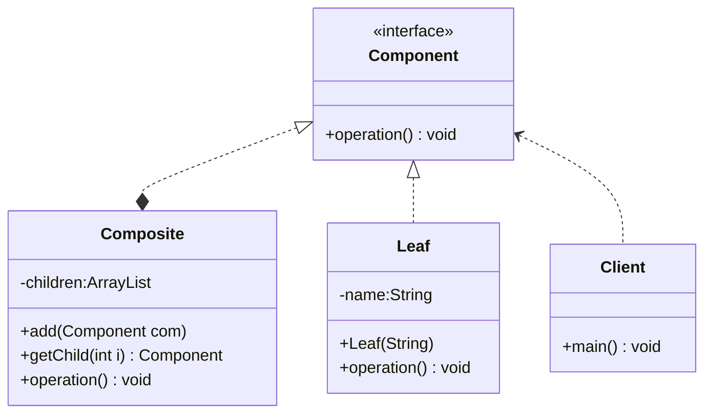

# 设计模式

## 设计原则

结构型模式描述如何将类或对象按某种布局组成更大的结构。它分为类结构型模式和对象结构型模式，前者采用继承机制来组织接口和类，后者釆用组合或聚合来组合对象。也可分为[代理模式](http://c.biancheng.net/view/1359.html)（Proxy）、[适配器模式](http://c.biancheng.net/view/1361.html)（Adapter）、[桥接模式](http://c.biancheng.net/view/1364.html)（Bridge）、[装饰模式](http://c.biancheng.net/view/1366.html) （Decorator ）、[外观模式](http://c.biancheng.net/view/1369.html)（Facade）、享元模式（Flyweight）和[组合模式](http://c.biancheng.net/view/1373.html)（Composite）等 7 类。

[toc]

## 结构模式分为以下几种。

1. 代理（Proxy）模式：为某对象提供一种代理以控制对该对象的访问。即客户端通过代理间接地访问该对象，从而限制、增强或修改该对象的一些特性。
2. 适配器（Adapter）模式：将一个类的接口转换成客户希望的另外一个接口，使得原本由于接口不兼容而不能一起工作的那些类能一起工作。
3. 桥接（Bridge）模式：将抽象与实现分离，使它们可以独立变化。它是用组合关系代替继承关系来实现的，从而降低了抽象和实现这两个可变维度的耦合度。
4. 装饰（Decorator）模式：动态地给对象增加一些职责，即增加其额外的功能。
5. 外观（Facade）模式：为多个复杂的子系统提供一个一致的接口，使这些子系统更加容易被访问。
6. 享元（Flyweight）模式：运用共享技术来有效地支持大量细粒度对象的复用。
7. 组合（Composite）模式：将对象组合成树状层次结构，使用户对单个对象和组合对象具有一致的访问性。

### 代理模式

代理模式的定义：由于某些原因需要给某对象提供一个代理以控制对该对象的访问。这时，访问对象不适合或者不能直接引用目标对象，代理对象作为访问对象和目标对象之间的中介。

### 动态代理（java）

### 动态代理（cglib）

### 适配器模式

适配器模式（Adapter）的定义如下：将一个类的接口转换成客户希望的另外一个接口，使得原本由于接口不兼容而不能一起工作的那些类能一起工作。适配器模式分为类结构型模式和对象结构型模式两种，前者类之间的耦合度比后者高，且要求程序员了解现有组件库中的相关组件的内部结构，所以应用相对较少些。

### 适配器2

### 桥接

桥接（Bridge）模式的定义如下：将抽象与实现分离，使它们可以独立变化。它是用组合关系代替继承关系来实现，从而降低了抽象和实现这两个可变维度的耦合度。

桥接（Bridge）模式包含以下主要角色。

1. 抽象化（Abstraction）角色：定义抽象类，并包含一个对实现化对象的引用。
2. 扩展抽象化（Refined Abstraction）角色：是抽象化角色的子类，实现父类中的业务方法，并通过组合关系调用实现化角色中的业务方法。
3. 实现化（Implementor）角色：定义实现化角色的接口，供扩展抽象化角色调用。
4. 具体实现化（Concrete Implementor）角色：给出实现化角色接口的具体实现。

### 装饰器

装饰器（Decorator）模式的定义：指在不改变现有对象结构的情况下，动态地给该对象增加一些职责（即增加其额外功能）的模式，它属于对象结构型模式。

### 外观模式

又叫作门面模式，是一种通过为多个复杂的子系统提供一个一致的接口，而使这些子系统更加容易被访问的模式。该模式对外有一个统一接口，外部应用程序不用关心内部子系统的具体细节，这样会大大降低应用程序的复杂度，提高了程序的可维护性。

### 享元模式

享元（Flyweight）模式的定义：运用共享技术来有效地支持大量细粒度对象的复用。它通过共享已经存在的对象来大幅度减少需要创建的对象数量、避免大量相似类的开销，从而提高系统资源的利用率。

### 组合模式

有时又叫作整体-部分（Part-Whole）模式，它是一种将对象组合成树状的层次结构的模式，用来表示“整体-部分”的关系，使用户对单个对象和组合对象具有一致的访问性，属于结构型[设计模式]。

