# 设计模式

## 设计原则

行为型模式用于描述程序在运行时复杂的流程控制，即描述多个类或对象之间怎样相互协作共同完成单个对象都无法单独完成的任务，它涉及算法与对象间职责的分配。

[toc]

## 行为型模式。

1. 模板方法（Template Method）模式：定义一个操作中的算法骨架，将算法的一些步骤延迟到子类中，使得子类在可以不改变该算法结构的情况下重定义该算法的某些特定步骤。
2. 策略（Strategy）模式：定义了一系列算法，并将每个算法封装起来，使它们可以相互替换，且算法的改变不会影响使用算法的客户。
3. 命令（Command）模式：将一个请求封装为一个对象，使发出请求的责任和执行请求的责任分割开。
4. 职责链（Chain of Responsibility）模式：把请求从链中的一个对象传到下一个对象，直到请求被响应为止。通过这种方式去除对象之间的耦合。
5. 状态（State）模式：允许一个对象在其内部状态发生改变时改变其行为能力。
6. 观察者（Observer）模式：多个对象间存在一对多关系，当一个对象发生改变时，把这种改变通知给其他多个对象，从而影响其他对象的行为。
7. 中介者（Mediator）模式：定义一个中介对象来简化原有对象之间的交互关系，降低系统中对象间的耦合度，使原有对象之间不必相互了解。
8. 迭代器（Iterator）模式：提供一种方法来顺序访问聚合对象中的一系列数据，而不暴露聚合对象的内部表示。
9. 访问者（Visitor）模式：在不改变集合元素的前提下，为一个集合中的每个元素提供多种访问方式，即每个元素有多个访问者对象访问。
10. 备忘录（Memento）模式：在不破坏封装性的前提下，获取并保存一个对象的内部状态，以便以后恢复它。
11. 解释器（Interpreter）模式：提供如何定义语言的文法，以及对语言句子的解释方法，即解释器。

### 模板方法

模板方法（Template Method）模式的定义如下：定义一个操作中的算法骨架，而将算法的一些步骤延迟到子类中，使得子类可以不改变该算法结构的情况下重定义该算法的某些特定步骤。它是一种类行为型模式。

该模式的主要优点如下。

1. 它封装了不变部分，扩展可变部分。它把认为是不变部分的算法封装到父类中实现，而把可变部分算法由子类继承实现，便于子类继续扩展。
2. 它在父类中提取了公共的部分代码，便于代码复用。
3. 部分方法是由子类实现的，因此子类可以通过扩展方式增加相应的功能，符合开闭原则。

该模式的主要缺点如下。

1. 对每个不同的实现都需要定义一个子类，这会导致类的个数增加，系统更加庞大，设计也更加抽象，间接地增加了系统实现的复杂度。
2. 父类中的抽象方法由子类实现，子类执行的结果会影响父类的结果，这导致一种反向的控制结构，它提高了代码阅读的难度。
3. 由于继承关系自身的缺点，如果父类添加新的抽象方法，则所有子类都要改一遍。

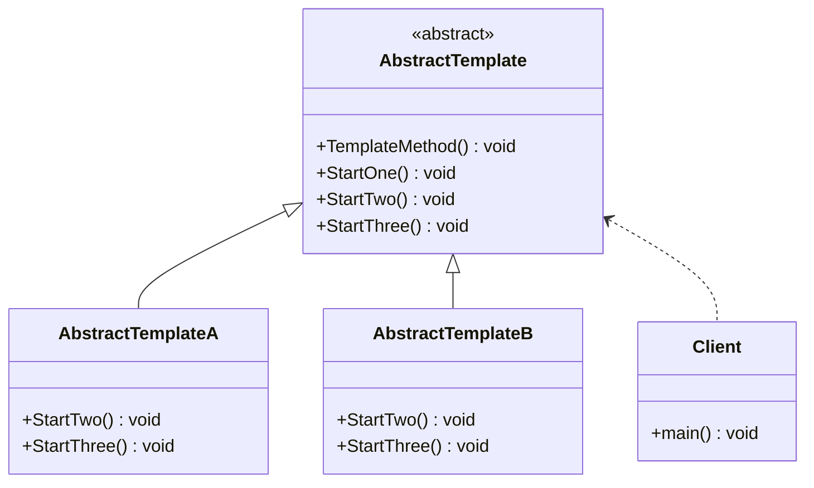

### 策略模式

策略（Strategy）模式的定义：该模式定义了一系列算法，并将每个算法封装起来，使它们可以相互替换，且算法的变化不会影响使用算法的客户。策略模式属于对象行为模式，它通过对算法进行封装，把使用算法的责任和算法的实现分割开来，并委派给不同的对象对这些算法进行管理。

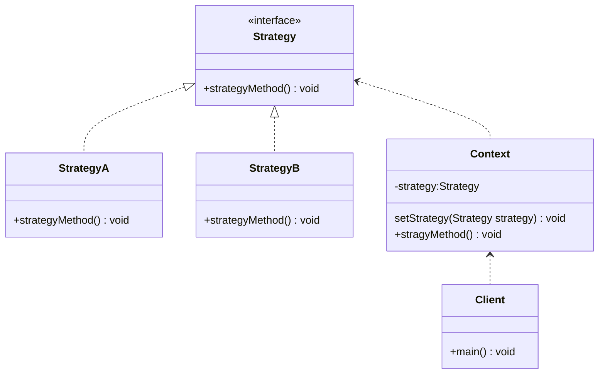

### 命令模式

命令（Command）模式的定义如下：将一个请求封装为一个对象，使发出请求的责任和执行请求的责任分割开。这样两者之间通过命令对象进行沟通，这样方便将命令对象进行储存、传递、调用、增加与管理。

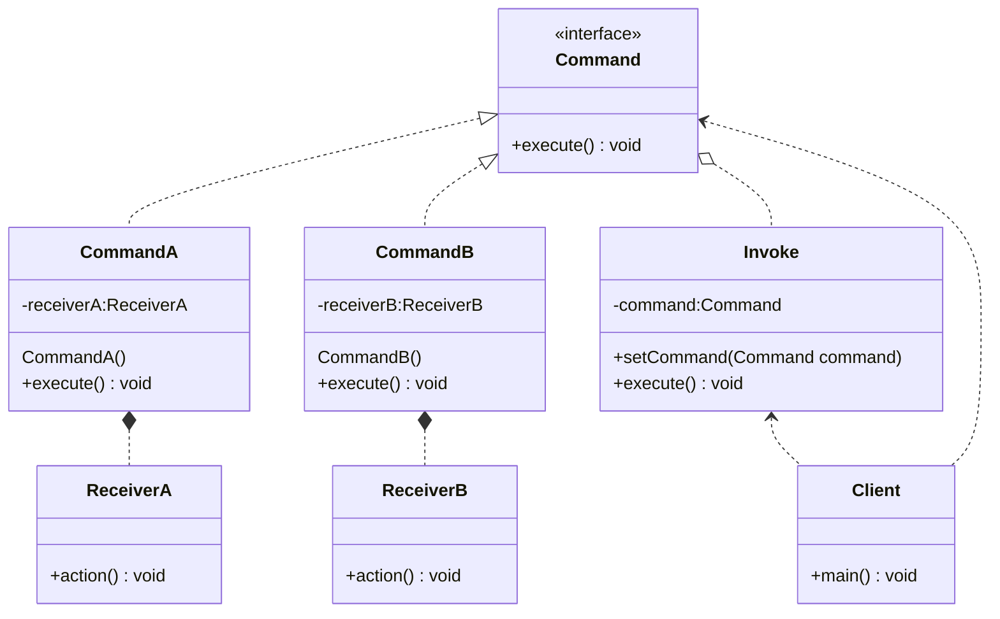

### 责任链模式

​       责任链（Chain of Responsibility）模式的定义：为了避免请求发送者与多个请求处理者耦合在一起，于是将所有请求的处理者通过前一对象记住其下一个对象的引用而连成一条链；当有请求发生时，可将请求沿着这条链传递，直到有对象处理它为止。

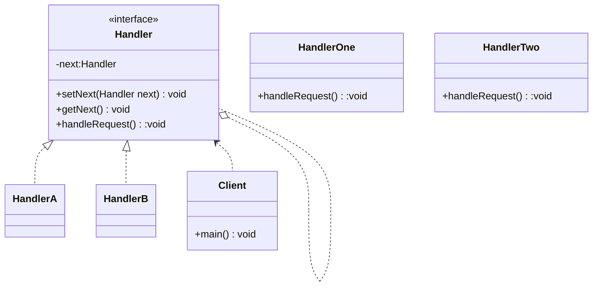

### 状态模式

状态（State）模式的定义：对有状态的对象，把复杂的“判断逻辑”提取到不同的状态对象中，允许状态对象在其内部状态发生改变时改变其行为。

状态模式是一种对象行为型模式，其主要优点如下。

1. 结构清晰，状态模式将与特定状态相关的行为局部化到一个状态中，并且将不同状态的行为分割开来，满足“单一职责原则”。
2. 将状态转换显示化，减少对象间的相互依赖。将不同的状态引入独立的对象中会使得状态转换变得更加明确，且减少对象间的相互依赖。
3. 状态类职责明确，有利于程序的扩展。通过定义新的子类很容易地增加新的状态和转换。

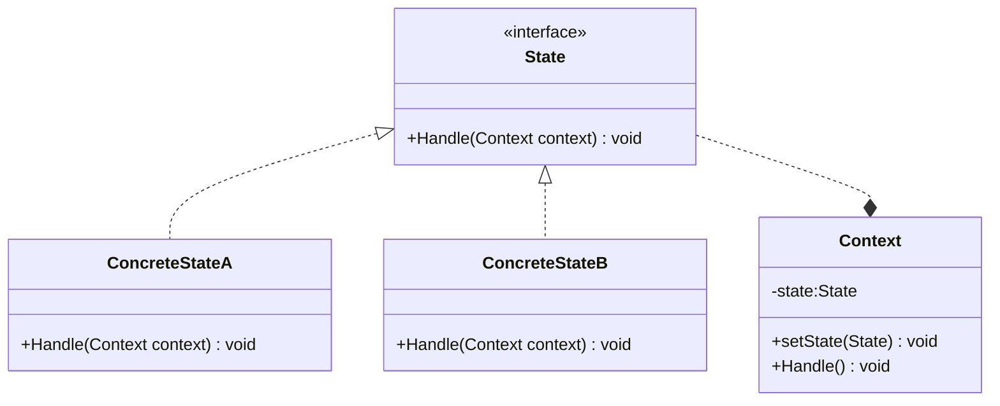
### 观察者模式

适配器模式（Adapter）的定义如下：将一个类的接口转换成客户希望的另外一个接口，使得原本由于接口不兼容而不能一起工作的那些类能一起工作。适配器模式分为类结构型模式和对象结构型模式两种，前者类之间的耦合度比后者高，且要求程序员了解现有组件库中的相关组件的内部结构，所以应用相对较少些。

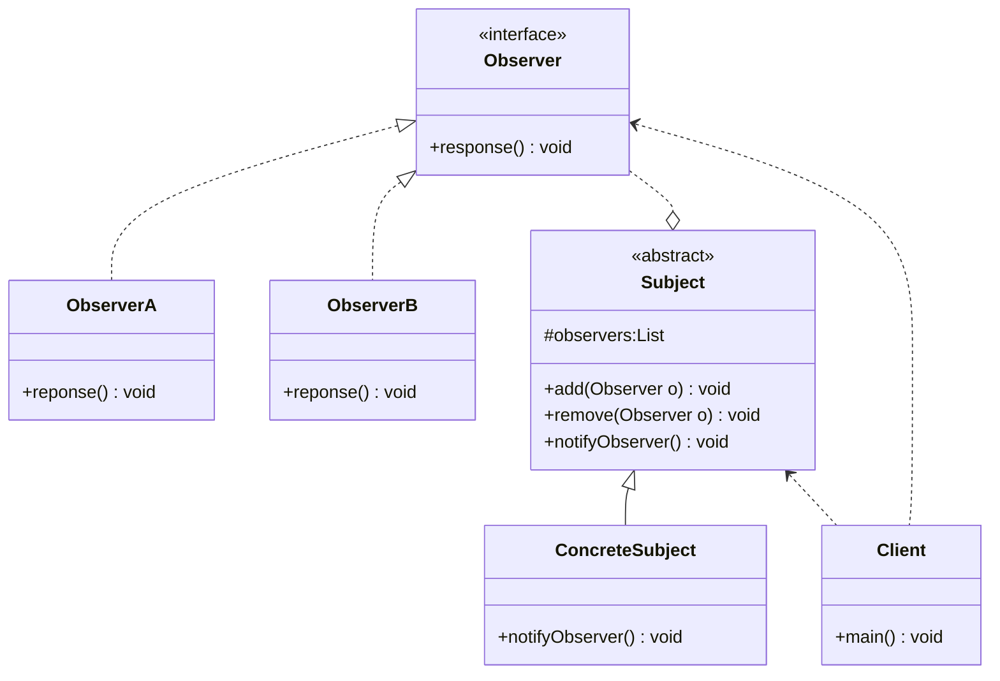

### 享元模式

享元（Flyweight）模式的定义：运用共享技术来有效地支持大量细粒度对象的复用。它通过共享已经存在的对象来大幅度减少需要创建的对象数量、避免大量相似类的开销，从而提高系统资源的利用率。

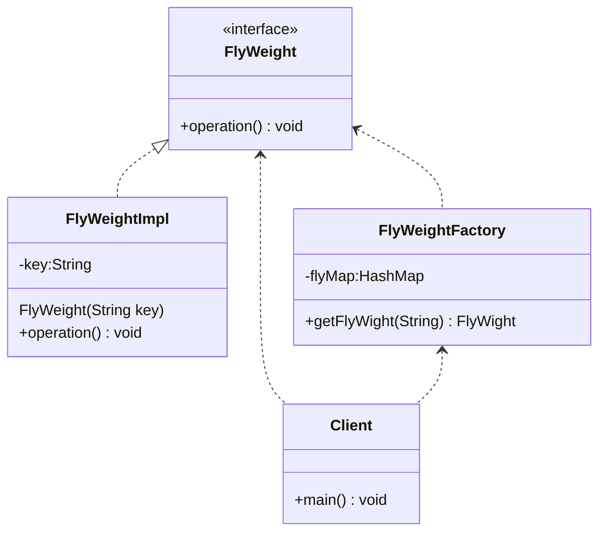

### 中介者模式

中介者（Mediator）模式的定义：定义一个中介对象来封装一系列对象之间的交互，使原有对象之间的耦合松散，且可以独立地改变它们之间的交互。中介者模式又叫调停模式，它是迪米特法则的典型应用。

中介者模式是一种对象行为型模式，其主要优点如下。

1. 类之间各司其职，符合迪米特法则。
2. 降低了对象之间的耦合性，使得对象易于独立地被复用。
3. 将对象间的一对多关联转变为一对一的关联，提高系统的灵活性，使得系统易于维护和扩展。

其主要缺点是：中介者模式将原本多个对象直接的相互依赖变成了中介者和多个同事类的依赖关系。当同事类越多时，中介者就会越臃肿，变得复杂且难以维护。

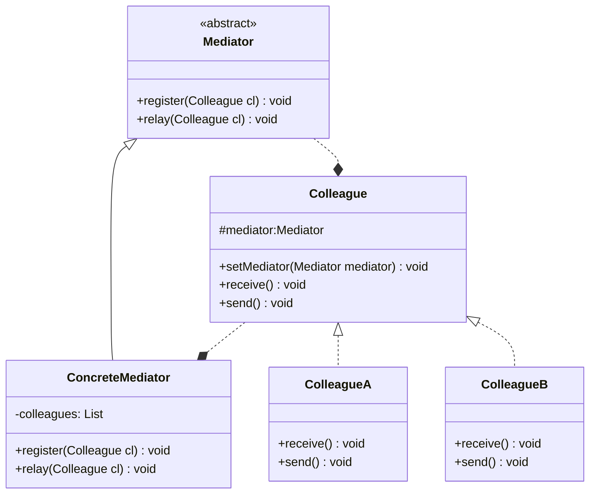

### 迭代模式

迭代器（Iterator）模式的定义：提供一个对象来顺序访问聚合对象中的一系列数据，而不暴露聚合对象的内部表示。迭代器模式是一种对象行为型模式，其主要优点如下。

1. 访问一个聚合对象的内容而无须暴露它的内部表示。
2. 遍历任务交由迭代器完成，这简化了聚合类。
3. 它支持以不同方式遍历一个聚合，甚至可以自定义迭代器的子类以支持新的遍历。
4. 增加新的聚合类和迭代器类都很方便，无须修改原有代码。
5. 封装性良好，为遍历不同的聚合结构提供一个统一的接口。

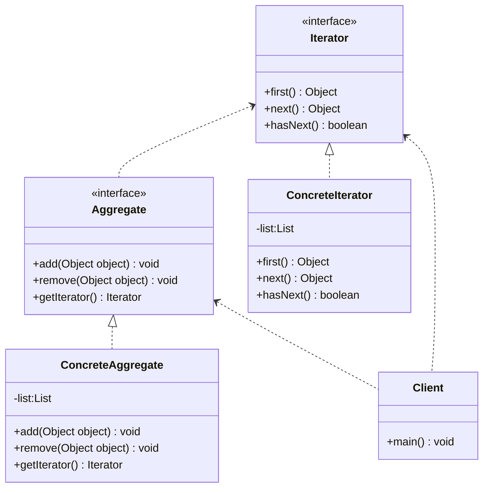

### 访问者模式

访问者（Visitor）模式的定义：将作用于某种数据结构中的各元素的操作分离出来封装成独立的类，使其在不改变数据结构的前提下可以添加作用于这些元素的新的操作，为数据结构中的每个元素提供多种访问方式。它将对数据的操作与数据结构进行分离，是行为类模式中最复杂的一种模式。

访问者（Visitor）模式的主要缺点如下。

1. 增加新的元素类很困难。在访问者模式中，每增加一个新的元素类，都要在每一个具体访问者类中增加相应的具体操作，这违背了“开闭原则”。
2. 破坏封装。访问者模式中具体元素对访问者公布细节，这破坏了对象的封装性。
3. 违反了依赖倒置原则。访问者模式依赖了具体类，而没有依赖抽象类。

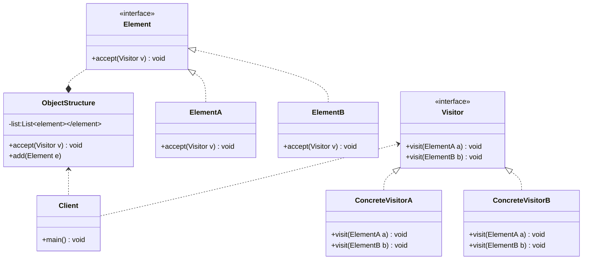

### 备忘录模式

备忘录（Memento）模式的定义：在不破坏封装性的前提下，捕获一个对象的内部状态，并在该对象之外保存这个状态，以便以后当需要时能将该对象恢复到原先保存的状态。该模式又叫快照模式。

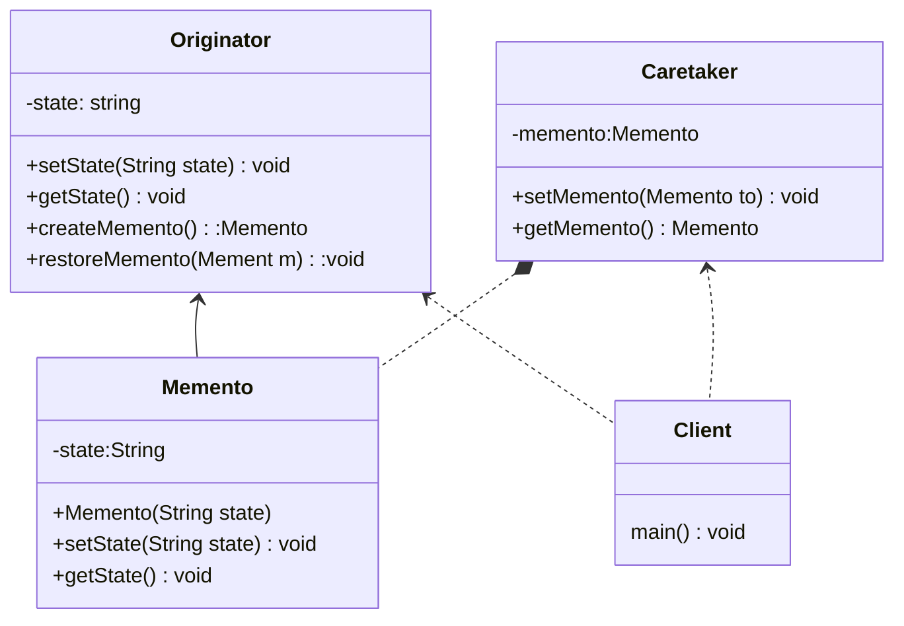

 解释器模式

​       解释器（Interpreter）模式的定义：给分析对象定义一个语言，并定义该语言的文法表示，再设计一个解析器来解释语言中的句子。也就是说，用编译语言的方式来分析应用中的实例。这种模式实现了文法表达式处理的接口，该接口解释一个特定的上下文。

解释器模式是一种类行为型模式，其主要优点如下。

1. 扩展性好。由于在解释器模式中使用类来表示语言的文法规则，因此可以通过继承等机制来改变或扩展文法。
2. 容易实现。在语法树中的每个表达式节点类都是相似的，所以实现其文法较为容易。

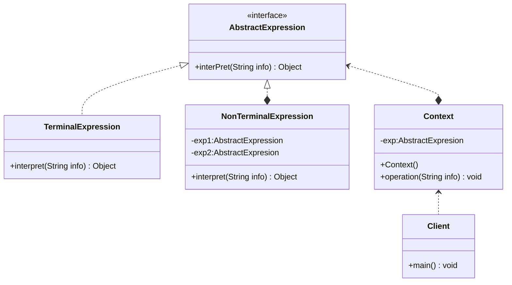

